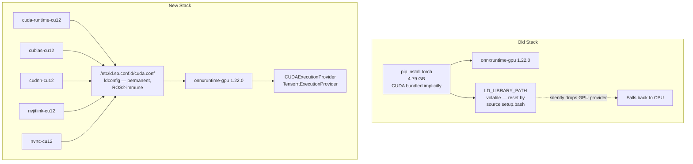

Week 1 removed the caches. Week 2 went after the two biggest single sources of bloat in the entire image: the **4.6 GB copy-on-write ghost layer** produced by the `RoboticsInfrastructure` clone, and the **4.79 GB PyTorch layer** that was sitting in the image without being the right tool for the job. Both are gone. The new baseline is **19.2 GB**, down from 26.4 GB — a 7.2 GB reduction in a single week.


## First Half — The 4.6 GB Ghost Layer

The community bonding audit had already identified the root cause of this one. In `Dockerfile.humble`, the `RoboticsInfrastructure` repository was cloned in one `RUN` instruction (producing a **4.61 GB** layer), packages were relocated with `mv` in a second instruction (**2.91 GB** layer), and the `.git` directory was deleted in a third. Because each `RUN` produces an independent overlay layer in Docker's copy-on-write filesystem, all three states were baked permanently into the image history. The full clone — `.git` pack files and all — never left the image regardless of what the later steps did.

The fix was to collapse all three steps into a single atomic `RUN` block so Docker only records the final state:

```dockerfile
# Before — three separate layers, ghost data accumulates permanently
RUN git clone --depth 1 https://github.com/JdeRobot/RoboticsInfrastructure.git /tmp/RI
RUN mv /tmp/RI/Launchers /opt/jderobot/ && \
    mv /tmp/RI/Universes /opt/jderobot/ && \
    mv /tmp/RI/Worlds /opt/jderobot/
RUN rm -rf /tmp/RI

# After — single layer, only the final filesystem state is recorded
RUN git clone --depth 1 https://github.com/JdeRobot/RoboticsInfrastructure.git /tmp/RI && \
    mv /tmp/RI/Launchers /opt/jderobot/ && \
    mv /tmp/RI/Universes /opt/jderobot/ && \
    mv /tmp/RI/Worlds /opt/jderobot/ && \
    rm -rf /tmp/RI
```

One constraint that had to be respected: `/opt/jderobot/Launchers`, `/Universes`, and `/Worlds` are hardcoded paths in both the PostgreSQL database and the Django backend. Moving them to a different destination would have broken exercise routing silently. The structure was preserved exactly. The `.git` history was also stripped from every other git clone in the same file — `aerostack2`, `IndustrialRobots`, `gz_ros2_control` — using the same single-RUN pattern, since none of them need their git history at runtime.

The result: **26.4 GB → 21.8 GB**, and `dive` confirmed 96% image efficiency with the infrastructure duplication fully removed.

| Metric | Before | After |
|---|---|---|
| Full image size | 26.4 GB | **21.8 GB** |
| Ghost layer eliminated | — | **−4.6 GB** |
| `dive` efficiency score | — | **96%** |


PR [#3856](https://github.com/JdeRobot/RoboticsAcademy/pull/3856) tracks this change.


## Second Half — Evicting PyTorch

With the image at 21.8 GB, the next target was the largest remaining layer: the **4.79 GB PyTorch install** that sat in `Dockerfile.dependencies_humble`. PyTorch was originally included to provide GPU-accelerated tensor operations for the deep learning exercises. But the platform does not do PyTorch training — it does inference. And inference at this scale is exactly what ONNX Runtime is built for.

Javier had flagged in the Week 1 sync that an earlier attempt to swap PyTorch for ONNX Runtime had failed. That attempt had hit a GPU provider loading issue — `onnxruntime-gpu` could find the CUDA libraries at build time but lost them at runtime when ROS 2 workspace sourcing (`setup.bash`) overwrote the environment. The root cause was relying on `LD_LIBRARY_PATH` to expose the CUDA shared objects. ROS 2 replaces that variable when you source a workspace, and the GPU provider silently fell back to CPU.

The second attempt fixed the architecture of the dependency wiring rather than just the packages.


### The Architecture: What Changed

The old stack pulled in PyTorch's bundled CUDA as a side effect of a single pip install. The new stack is explicit: only the 5 CUDA pip wheels that `onnxruntime-gpu` actually needs at runtime are installed, and their shared library paths are written permanently into the system linker cache using `/etc/ld.so.conf.d/` rather than being set in an environment variable.



The `ldconfig` approach bakes the NVIDIA library paths directly into the system's dynamic linker cache. It runs once at build time and does not depend on any shell variable. Sourcing any number of ROS 2 workspaces has no effect on it. `numpy` and `onnx` were also added explicitly to the foundational layer — they had been arriving transitively through PyTorch, and without pinning them directly they would have been silently stripped.

The `dev-test-compose.yaml` orchestration file also needed a patch: the GPU resource reservation block had not been declared, so the host NVIDIA drivers were not being mapped into the container at runtime. Added the explicit `driver: nvidia` reservation to fix that.

```yaml
deploy:
  resources:
    reservations:
      devices:
        - driver: nvidia
          count: all
          capabilities: [gpu]
```


### Testing — Four Layers

Shipping a GPU change without layered verification is how silent regressions happen, so the `gsoc_test_image_v6` build was put through four explicit checks before being called done.

**Layer 1 — Hardware mapping.** Running `nvidia-smi` through the compose stack confirmed the host GeForce GTX 1650 was visible inside the container with no fallback warnings.

**Layer 2 — System linker and provider availability.** `ldconfig -p` explicitly listed all 5 required `.so` files pointing to their pip dist-packages locations. An isolated Python shell confirmed `onnxruntime.get_available_providers()` returned `['TensorrtExecutionProvider', 'CUDAExecutionProvider', 'CPUExecutionProvider']` in that order.

**Layer 3 — UI and integration validation.** The full stack was booted via the patched compose profile. The frontend workspace registry rendered correctly, and the vision-heavy exercises loaded their Gazebo worlds and noVNC video streams without any runtime exception or tracking regression.

**Layer 4 — End-to-end inference.** A minimal ONNX identity model (IR Version 8, Opset 13) was generated and executed directly on the GPU inside the container. The execution output:

```
Active provider: CUDAExecutionProvider
PASS: GPU inference completed successfully
```


All four layers passed on `gsoc_test_image_v6` (Image ID: `fcd9373d4326`).


### Week 2 Final Numbers

| Metric | Start of Week | After Ghost Layer | After PyTorch Removal | Total Change |
|---|---|---|---|---|
| Image size | 26.4 GB | 21.8 GB | **19.2 GB** | **−7.2 GB** |
| PyTorch layer | 4.79 GB | 4.79 GB | **0** | **−4.79 GB** |
| GPU inference | working | working | **working via CUDA wheels** | no regression |
| ROS2 env immunity | no | no | **yes (ldconfig)** | new property |


## What is Next

The 19.2 GB number is the new baseline. A few things need to happen before these changes can merge cleanly.

The CUDA wheel versions — `nvidia-curand-cu12` (10.3.10.19) and `nvidia-cufft-cu12` (11.4.1.4) — are not yet pinned in the Dockerfile. They need to be hard-pinned to prevent silent ABI mismatches from upstream PyPI updates during CI builds.

The C++ ONNX Runtime headers currently installed in the image are frozen at version 1.17.1 while the Python runtime is at 1.22.0. That version gap is a latent crash variable for any exercises that invoke the C++ API, and it needs to be aligned.

On the tooling side, the GitHub Actions workflow (`generate_Robotics_Academy.yml`) does not currently have a GPU testing gate. Adding a self-hosted GPU runner step would give a permanent regression signal for the CUDA execution path instead of relying on manual verification.

Finally, some student exercises write `import torch` directly in their solutions. Those will now hit `ModuleNotFoundError`. The cleanest fix is a conditional Docker build argument that gates a CPU-only PyTorch variant (~170 MB instead of 4.79 GB) for exercises that need it, without re-introducing the full GPU bloat into the main image.

Next week: OMPL. The 34-minute compile and 2.4 GB layer is the next major target.

*Part of my GSoC 2026 work with JdeRobot. Project tracked at [github.com/TheRoboticsClub/gsoc2026-Kartik_Jangid](https://github.com/TheRoboticsClub/gsoc2026-Kartik_Jangid).*
